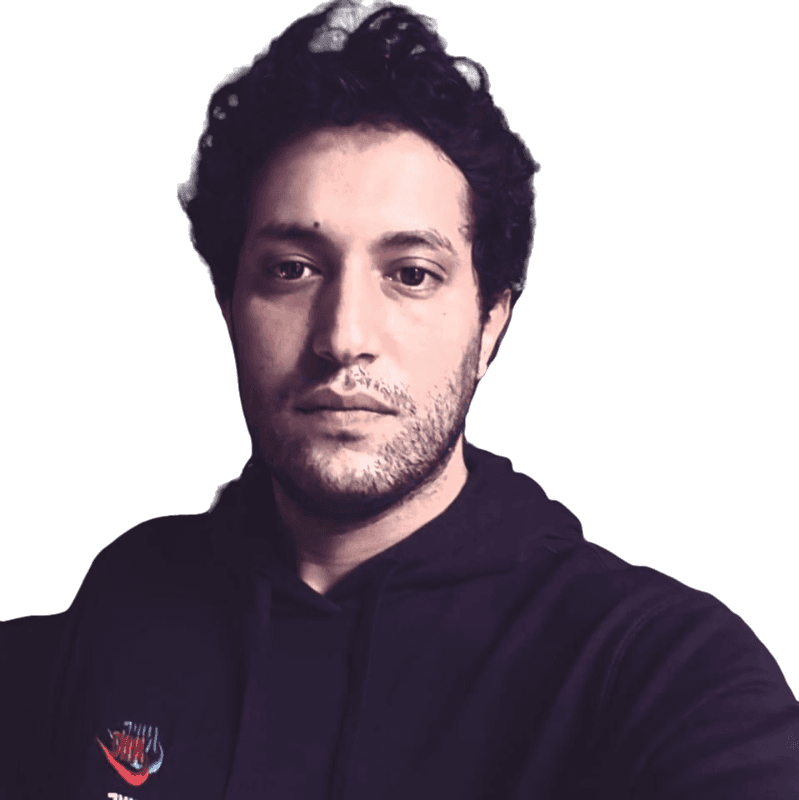

#### Introduction  
  
¬ Greetings! I'm Ali, a data scientist who possesses a profound ardor for machine learning and a data-centric, analytical perspective. Presently, I'm pursuing a doctoral degree, and my research interests are inclined towards utilizing machine learning algorithms for inferring everyday human behavior through non-invasive sensorial data modeling. Moreover, I'm captivated by the realm of deep learning and its potential in interpreting natural signals such as language, image, and audio. This personal blog has been crafted to dispense insightful resources and practical tools that I've stumbled upon whilst working with data. By following the links below, you can explore a selection of my works in this field. Additionally, you may check out the [Curriculum Vitae](./cv) (last updated in August 2022) section to delve further into my academic and professional background. I'm thrilled to engage with other data science enthusiasts and share my experiences through this platform.

#### PhD work
Details about my ongoing research work can be found below.

###### **[🧪 The team (DAVID lab. PETRUS team - INRIA/UVSQ)](https://team.inria.fr/petrus/petrus-team/)**
###### **[🧪 The topic (coming soon)](./#)**
###### **[🧪 Contributions (coming soon)](./#)**
###### **[🧪 The code (coming soon)](./#)**

#### Personal work
Links to some of my personal projects are listed below.

###### **[🧪 Deep-learning-based semantic relation extraction systems.](https://github.com/ylaxor/relex)** 
###### **[🧪 Task-oriented dialog system prototype.](./chatbot)** 
###### **[🧪 Temporal links extraction between events in french text.](./tlinks)**
###### **[🧪 Style transfer for symbolic drums using deep leaning.](./drums)** 

#### Writings (coming soon)
###### [📜 Miscelaneous software development topics](./#)  
###### [📜 Developing software under the Machine learning paradigm](./#)

#### Get in touch ?
**[Please do not hesitate to 💌 me](mailto:contact@alincibi.me)**. I eagerly anticipate hearing from you 😸.
 
